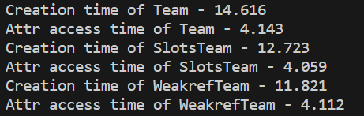
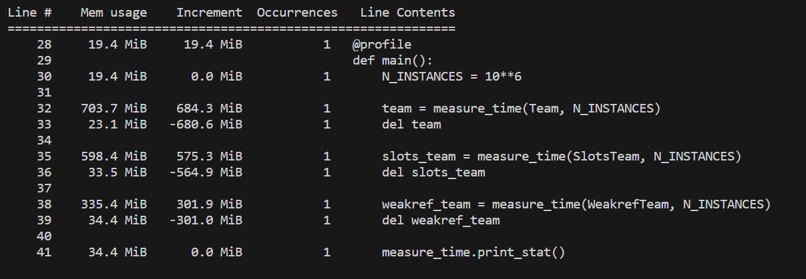
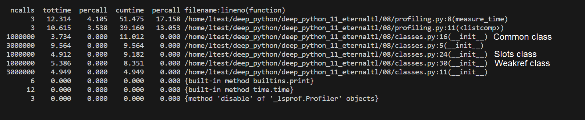

# deep_python_11

<body class="indexfile">
<header>
    

        <h1>01 | Coverage report:
            99%
        </h1>
    

</header>
<main id="index">
    <table class="index" data-sortable>
        <thead>
            <tr class="tablehead" title="Click to sort">
                <th class="name left" aria-sort="none" data-shortcut="n">Module</th>
                <th aria-sort="none" data-default-sort-order="descending" data-shortcut="s">statements</th>
                <th aria-sort="none" data-default-sort-order="descending" data-shortcut="m">missing</th>
                <th aria-sort="none" data-default-sort-order="descending" data-shortcut="x">excluded</th>
                <th class="right" aria-sort="none" data-shortcut="c">coverage</th>
            </tr>
        </thead>
        <tbody>
            <tr class="file">
                <td class="name left"><a href="filter_generator_py.html">filter_generator.py</a></td>
                <td>20</td>
                <td>0</td>
                <td>0</td>
                <td class="right" data-ratio="20 20">100%</td>
            </tr>
            <tr class="file">
                <td class="name left"><a href="predict_message_mood_py.html">predict_message_mood.py</a></td>
                <td>22</td>
                <td>2</td>
                <td>0</td>
                <td class="right" data-ratio="20 22">91%</td>
            </tr>
            <tr class="file">
                <td class="name left"><a href="test_filter_generator_py.html">test_filter_generator.py</a></td>
                <td>94</td>
                <td>0</td>
                <td>0</td>
                <td class="right" data-ratio="94 94">100%</td>
            </tr>
            <tr class="file">
                <td class="name left"><a href="test_predict_message_mood_py.html">test_predict_message_mood.py</a></td>
                <td>60</td>
                <td>0</td>
                <td>0</td>
                <td class="right" data-ratio="60 60">100%</td>
            </tr>
        </tbody>
        <tfoot>
            <tr class="total">
                <td class="name left">Total</td>
                <td>196</td>
                <td>2</td>
                <td>0</td>
                <td class="right" data-ratio="194 196">99%</td>
            </tr>
        </tfoot>
    </table>
</main>
</body>
<body class="indexfile">
<header>
    

        <h1>02 | Coverage report:
            100%
        </h1>
    

</header>
<main id="index">
    <table class="index" data-sortable>
        <thead>
            <tr class="tablehead" title="Click to sort">
                <th class="name left" aria-sort="none" data-shortcut="n">Module</th>
                <th aria-sort="none" data-default-sort-order="descending" data-shortcut="s">statements</th>
                <th aria-sort="none" data-default-sort-order="descending" data-shortcut="m">missing</th>
                <th aria-sort="none" data-default-sort-order="descending" data-shortcut="x">excluded</th>
                <th class="right" aria-sort="none" data-shortcut="c">coverage</th>
            </tr>
        </thead>
        <tbody>
            <tr class="file">
                <td class="name left"><a href="decorators_py.html">decorators.py</a></td>
                <td>19</td>
                <td>0</td>
                <td>0</td>
                <td class="right" data-ratio="19 19">100%</td>
            </tr>
            <tr class="file">
                <td class="name left"><a href="parse_json_py.html">parse_json.py</a></td>
                <td>18</td>
                <td>0</td>
                <td>0</td>
                <td class="right" data-ratio="10 10">100%</td>
            </tr>
            <tr class="file">
                <td class="name left"><a href="test_decorator_py.html">test_decorator.py</a></td>
                <td>24</td>
                <td>0</td>
                <td>0</td>
                <td class="right" data-ratio="24 24">100%</td>
            </tr>
            <tr class="file">
                <td class="name left"><a href="test_parse_json_py.html">test_parse_json.py</a></td>
                <td>121</td>
                <td>0</td>
                <td>0</td>
                <td class="right" data-ratio="114 114">100%</td>
            </tr>
        </tbody>
        <tfoot>
            <tr class="total">
                <td class="name left">Total</td>
                <td>182</td>
                <td>0</td>
                <td>0</td>
                <td class="right" data-ratio="167 167">100%</td>
            </tr>
        </tfoot>
    </table>
</main>
</body>

<body class="indexfile">
<header>
    

        <h1>08 | Profiling:</h1>
        <h3>Время создания и доступа к атрибутам.</h3>
        
        
Экземпляры класса со слабыми ссылками создаются быстрее. Это может быть связано с тем, что слабые ссылки не увеличивают счетчик ссылок объекта и не требуют дополнительных операций для отслеживания ссылок на него

        
__slots__ не создает поля  __dict__ и __weakref__, что приводит к ускорению процесса создания экземпляров класса.

        
В среднем, время чтения и записи атрибутов для всех классов примерно одинаковое, но в некоторых случаях экземпляры класса со слотами отрабатывают немного быстрее.

        <h3>Память</h3>
        
        
Экземпляры класса со слабыми ссылками занимают меньше всего памяти. Больше всего памяти занимают экземпляры обычного класса.

        <h3>Вызовы</h3>
        
        
Инициализация экземпляров обычного класса заняла больше всего времени. Экземпляры класса со слабыми ссылками имеет самую высокую производительность. Экземпляры класса со слотами инициализируются быстрее, чем экземпляры обычного класса, но медленнее экземпляров класса со слабыми ссылками.

        <h3>Общие выводы</h3>
        
Из полученных данных можно сделать вывод, что использование слотов или слабых ссылок в классах значительно улучшает производительность и снижает затраты памяти.

    

</header>
</body>